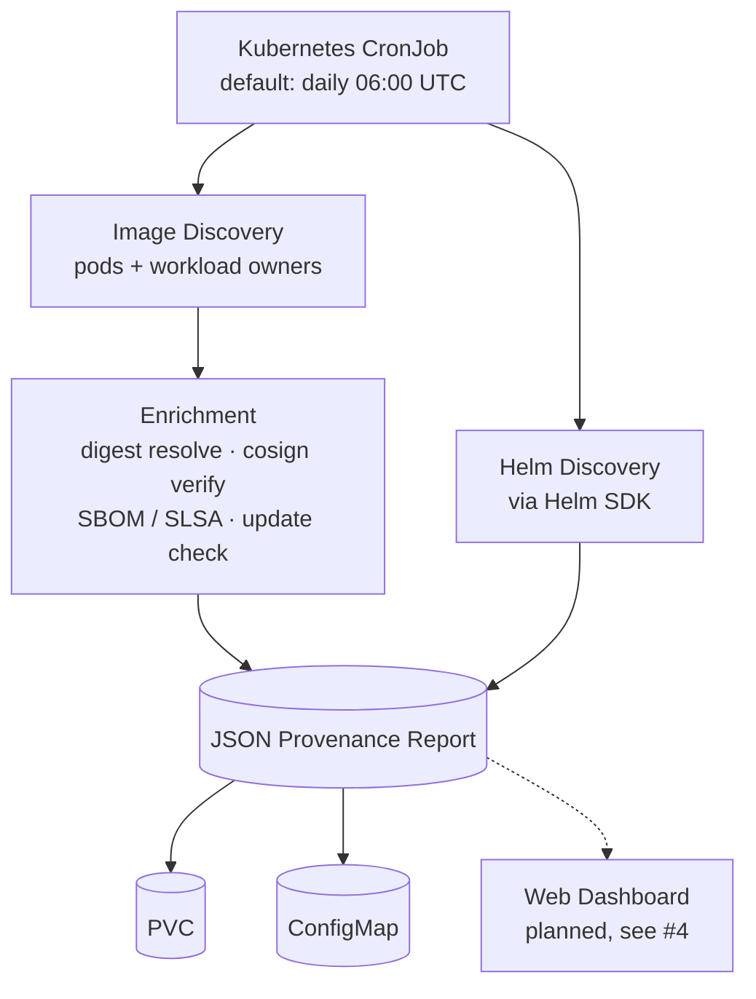

<p align="center">
  <a href="https://nebari.dev">
    <picture>
      <source media="(prefers-color-scheme: dark)" srcset="https://raw.githubusercontent.com/nebari-dev/nebari-design/main/logo-mark/horizontal/standard/Nebari-Logo-Horizontal-Lockup-White-text.png">
      <source media="(prefers-color-scheme: light)" srcset="https://raw.githubusercontent.com/nebari-dev/nebari-design/main/logo-mark/horizontal/standard/Nebari-Logo-Horizontal-Lockup.png">
      
    </picture>
  </a>
</p>

<h1 align="center">Provenance Collector</h1>

<p align="center">
  <strong>Compliance-grade provenance for every container running on your Nebari cluster.</strong><br />
  A Kubernetes-native CronJob that discovers running images and Helm releases, resolves digests, verifies
  signatures, detects SBOMs, checks for updates, and emits a timestamped JSON report.
</p>

<p align="center">
  <a href="https://github.com/nebari-dev/nebari-provenance-collector-pack/actions/workflows/test.yaml"></a>
  <a href="https://github.com/nebari-dev/nebari-provenance-collector-pack/actions/workflows/lint.yaml"></a>
  <a href="https://github.com/nebari-dev/nebari-provenance-collector-pack/actions/workflows/build-image.yaml"></a>
  <a href="https://github.com/nebari-dev/nebari-provenance-collector-pack/blob/main/LICENSE"></a>
  <a href="https://github.com/nebari-dev/nebari-provenance-collector-pack/releases/latest"></a>
  <a href="https://golang.org"></a>
</p>

<p align="center">
  <a href="#architecture">Architecture</a> &middot;
  <a href="#quick-start">Quick Start</a> &middot;
  <a href="#helm-install">Helm Install</a> &middot;
  <a href="#configuration">Configuration</a> &middot;
  <a href="#report-format">Report Format</a> &middot;
  <a href="#development">Development</a> &middot;
  <a href="docs/configuration.md">Config Reference</a> &middot;
  <a href="docs/report-schema.md">Report Schema</a>
</p>

> **Status**: Under active development as part of Nebari Infrastructure Core (NIC). APIs, chart values, and report
> schema may change without notice while pre-1.0.

## What is the Provenance Collector?

The Provenance Collector is a **Nebari Software Pack** that produces compliance-grade supply-chain reports for every
container image and Helm release running on a Kubernetes cluster. It is deployed automatically by the
[Nebari Operator](https://github.com/nebari-dev/nebari-operator) as part of NIC's foundational software, runs on a
schedule as a `CronJob`, and emits a timestamped JSON report to a PVC or `ConfigMap` for downstream consumption
(dashboards, audit submissions, Grafana, ad-hoc `jq`).

It exists because answering *"what is actually running on this cluster, where did it come from, and is it signed?"*
should not require manual auditing.

## Architecture



The collector reads the Kubernetes API for inventory, the registry (or pod-reported digest, when air-gapped) for
enrichment, and writes one report per run. It does not push to remote services or mutate cluster state.

## Key Features

| Capability | Description |
| --- | --- |
| **Image Discovery** | Scans pods across namespaces, deduplicates by workload owner (Deployment, StatefulSet, DaemonSet, Job, CronJob) |
| **Digest Resolution** | Resolves every image tag to its immutable SHA256 digest |
| **Signature Verification** | Detects cosign signatures (existence check or key-based verification) |
| **SBOM / SLSA Detection** | Detects attached SPDX / CycloneDX SBOMs and SLSA provenance attestations |
| **Update Checking** | Compares running tags against latest available semver tags in the registry |
| **Helm Release Tracking** | Discovers deployed Helm releases with chart and app versions |
| **Provenance Reports** | Outputs timestamped JSON reports to PVC or ConfigMap |
| **Nebari Integration** | Optional `NebariApp` CR registers the pack with the Nebari Operator |

## Quick Start

### Prerequisites

| Tool | Minimum version | Notes |
| --- | --- | --- |
| `kubectl` | 1.26+ | Cluster interaction |
| `helm` | 3.14+ | Chart install |
| Kubernetes cluster | 1.26+ | Local (kind / k3d / minikube) or remote |
| Cluster permissions | `cluster-admin` | Chart creates a `ClusterRole` + `ClusterRoleBinding` |
| Nebari Operator CRDs | optional | Only required when `nebariapp.enabled=true` (see [docs/nebariapp-crd-reference.md](docs/nebariapp-crd-reference.md)) |

### Install (standalone)

The chart is published as an OCI artifact at `quay.io/nebari/charts`.

```bash
helm install provenance-collector \
  oci://quay.io/nebari/charts/provenance-collector \
  --version 0.1.0-alpha.3 \
  --namespace provenance-system \
  --create-namespace
```

To install from a local checkout instead (useful when iterating on the chart):

```bash
helm install provenance-collector ./chart \
  --namespace provenance-system \
  --create-namespace
```

> In a full Nebari / NIC deployment the chart is managed by the Nebari Operator and ArgoCD — you do not need to
> install it manually. See [Helm Install](#helm-install) for the operator-managed path.

### Verify

```bash
kubectl get cronjob -n provenance-system
kubectl get pods -n provenance-system -l app.kubernetes.io/name=provenance-collector
```

### Trigger a manual run

```bash
kubectl create job --from=cronjob/provenance-collector \
  manual-run -n provenance-system

kubectl wait --for=condition=complete job/manual-run \
  -n provenance-system --timeout=5m
```

### View the report

```bash
# PVC-based output (default)
kubectl logs -n provenance-system job/manual-run

# ConfigMap-based output
kubectl get configmap provenance-report \
  -n provenance-system \
  -o jsonpath='{.data.report\.json}' | jq .
```

### Uninstall

```bash
helm uninstall provenance-collector -n provenance-system

# Also remove the namespace (and any PVC-stored reports):
kubectl delete namespace provenance-system
```

## Helm Install

> **Note**: In a full Nebari / NIC deployment the chart is managed by the Nebari Operator and ArgoCD — the
> snippets below are for standalone clusters and for understanding what the operator deploys.

### Example: ArgoCD-managed deployment

This is what the pack looks like when consumed from an ArgoCD `Application` in a NIC cluster. `hostname` is the
only field most users need to change; everything else is reasonable for a production deploy.

```yaml
apiVersion: argoproj.io/v1alpha1
kind: Application
metadata:
  name: provenance-collector
  namespace: argocd
  labels:
    app.kubernetes.io/part-of: nebari-packs
    app.kubernetes.io/managed-by: nebari-infrastructure-core
  finalizers:
    - resources-finalizer.argocd.argoproj.io
spec:
  project: foundational

  source:
    repoURL: quay.io/nebari/charts
    chart: provenance-collector
    targetRevision: 0.1.0-alpha.3
    helm:
      releaseName: provenance-collector
      values: |
        image:
          tag: 0.1.0-alpha.3
        config:
          updateLevel: minor
        webUI:
          enabled: true
        nebariapp:
          enabled: true
          hostname: provenance.nebari.example.com
          routing:
            routes:
              - pathPrefix: /
                pathType: PathPrefix
          auth:
            groups: []
          landingPage:
            enabled: true
            healthCheck:
              enabled: true

  destination:
    server: https://kubernetes.default.svc
    namespace: provenance-system

  syncPolicy:
    managedNamespaceMetadata:
      labels:
        nebari.dev/managed: "true"
    automated:
      prune: true
      selfHeal: true
      allowEmpty: false
    syncOptions:
      - CreateNamespace=true
      - ServerSideApply=true
      - SkipDryRunOnMissingResource=true
```

`nebariapp.enabled: true` produces a `NebariApp` CR that registers the pack with the Nebari Operator so the
[Nebari Landing page](https://github.com/nebari-dev/nebari-landing) can surface it. Set it to `false` for clusters
that aren't running the operator.

### Example: minimal standalone values

```yaml
# values-standalone.yaml
schedule: "0 6 * * *"
config:
  reportOutput: configmap   # avoid PVC for ephemeral clusters
  verifySignatures: true
  checkUpdates: true
persistence:
  enabled: false
nebariapp:
  enabled: false
```

```bash
helm install provenance-collector \
  oci://quay.io/nebari/charts/provenance-collector \
  --version 0.1.0-alpha.3 \
  --namespace provenance-system \
  --create-namespace \
  --values values-standalone.yaml
```

### Private registries

When images are pulled from a private registry (e.g. Harbor, Artifactory, GHCR with a token), provide a
`docker-registry` Secret and point the chart at it. The collector will use those credentials for digest resolution,
signature lookup, SBOM detection, and update checks.

```bash
kubectl create secret docker-registry harbor-pull-secret \
  --docker-server=harbor.internal:5000 \
  --docker-username=robot \
  --docker-password=*** \
  -n provenance-system
```

```yaml
# values.yaml
registryCredentials:
  existingSecret: harbor-pull-secret
```

> Air-gapped clusters and private registry mirrors are tracked in
> [#1](https://github.com/nebari-dev/nebari-provenance-collector-pack/issues/1).

## Configuration

All collector configuration is via environment variables, set through `values.yaml` and rendered into a ConfigMap.
The most-used settings:

| Variable | Default | Description |
| --- | --- | --- |
| `PROVENANCE_NAMESPACES` | *(all)* | Comma-separated namespaces to scan |
| `PROVENANCE_EXCLUDE_NAMESPACES` | *(none)* | Namespaces to skip |
| `PROVENANCE_VERIFY_SIGNATURES` | `true` | Check cosign signatures |
| `PROVENANCE_COSIGN_PUBLIC_KEY` | *(empty)* | Path or KMS URI for cosign key (empty = existence check only) |
| `PROVENANCE_HELM_ENABLED` | `true` | Discover Helm releases |
| `PROVENANCE_CHECK_UPDATES` | `true` | Check for newer image tags |
| `PROVENANCE_REPORT_OUTPUT` | `pvc` | Report output: `pvc` or `configmap` |
| `PROVENANCE_REPORT_PATH` | `/reports` | Filesystem path for PVC reports |
| `PROVENANCE_REGISTRY_TIMEOUT` | `30s` | Timeout for registry operations |
| `PROVENANCE_REGISTRY_AUTH` | *(empty)* | Path to Docker `config.json` for private registry auth |
| `PROVENANCE_CLUSTER_NAME` | *(empty)* | Cluster name in report metadata |

See [docs/configuration.md](docs/configuration.md) for the full reference, including every env var and its
corresponding chart value.

## Report Format

Reports are JSON. The top-level shape:

```json
{
  "metadata": {
    "generatedAt": "2026-01-15T06:00:00Z",
    "collectorVersion": "0.1.0",
    "clusterName": "production",
    "namespacesScanned": ["default", "monitoring"]
  },
  "images": [
    {
      "image": "nginx:1.27-alpine",
      "digest": "sha256:abc123...",
      "namespace": "default",
      "workload": { "kind": "Deployment", "name": "nginx" },
      "signature": { "signed": true, "verified": true },
      "sbom": { "hasSBOM": true, "format": "spdx" },
      "update": {
        "currentTag": "1.27",
        "latestInMajor": "1.27.3",
        "updateAvailable": true
      }
    }
  ],
  "helmReleases": [
    {
      "releaseName": "ingress-nginx",
      "namespace": "ingress",
      "chart": "ingress-nginx",
      "version": "4.8.0",
      "appVersion": "1.9.4",
      "status": "deployed"
    }
  ],
  "summary": {
    "totalImages": 42,
    "uniqueImages": 28,
    "signedImages": 15,
    "verifiedImages": 12,
    "imagesWithSBOM": 10,
    "imagesWithUpdates": 5,
    "totalHelmReleases": 8,
    "helmReleasesWithUpdates": 2
  }
}
```

See [docs/report-schema.md](docs/report-schema.md) for the full schema reference.

## Development

### Build, test, lint

```bash
make build
make test
make lint
make docker-build
```

### Local testing with kind

```bash
kind create cluster
docker build -t provenance-collector:dev .
kind load docker-image provenance-collector:dev

helm install provenance-collector ./chart \
  --namespace provenance-system --create-namespace \
  --set image.repository=provenance-collector \
  --set image.tag=dev \
  --set image.pullPolicy=Never \
  --set config.reportOutput=configmap \
  --set persistence.enabled=false \
  --set config.verifySignatures=false

kubectl create job --from=cronjob/provenance-collector test-run \
  -n provenance-system
kubectl logs -n provenance-system job/test-run
```

### Project Structure

```
cmd/provenance-collector/     Entry point
internal/
  config/                     Environment-based configuration
  kubernetes/                 Client factory (in-cluster + kubeconfig)
  discovery/
    images.go                 Pod-based container image discovery
    helm.go                   Helm release discovery via Helm SDK
  registry/
    digest.go                 Digest resolution via go-containerregistry
    updates.go                Semver-based update checking
  verify/
    cosign.go                 Signature verification via cosign
    sbom.go                   SBOM attestation detection
  report/
    types.go                  Report JSON schema types
    generator.go              Orchestrator with concurrent enrichment
    writer.go                 PVC and ConfigMap output writers
chart/                        Helm chart (CronJob + RBAC + NebariApp)
docs/                         Configuration, report schema, NebariApp CRD reference
```

### RBAC

The collector requires cluster-wide read access:

| Resource | Verbs | Purpose |
| --- | --- | --- |
| `pods`, `namespaces` | get, list | Image discovery |
| `deployments`, `replicasets`, `statefulsets`, `daemonsets` | get, list | Owner resolution |
| `jobs`, `cronjobs` | get, list | Owner resolution |
| `secrets` | get, list | Helm release storage |
| `configmaps` | get, list, create, update | Report output |

## Contributing

Contributions are welcome.

```bash
git clone https://github.com/nebari-dev/nebari-provenance-collector-pack.git
cd nebari-provenance-collector-pack

make build
make test
```

- [Open issues](https://github.com/nebari-dev/nebari-provenance-collector-pack/issues) — bug reports, feature
  requests, and documentation gaps.
- [Configuration reference](docs/configuration.md) — every env var and its chart value.
- [Report schema](docs/report-schema.md) — JSON output structure.
- [NebariApp CRD reference](docs/nebariapp-crd-reference.md) — operator integration fields.

## License

BSD-3-Clause — see [LICENSE](LICENSE) for details.
